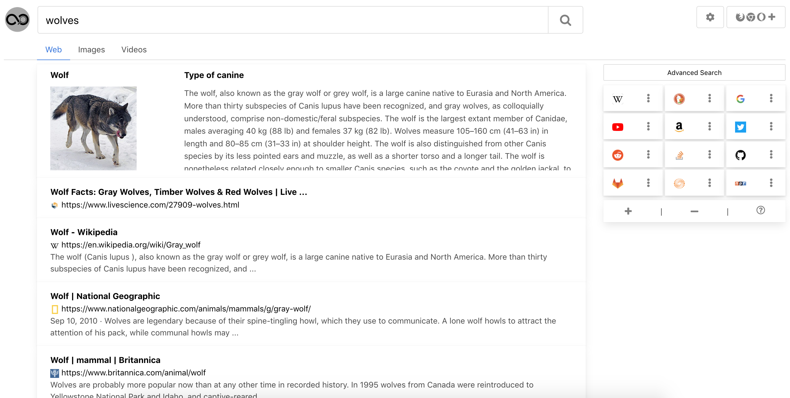

## Infinity Search Solo
A self-hostable metasearch engine that doesn't require any subscriptions

 

## Setup 

To run this program, all that you need to do is make sure that you have python3 and pip3 installed
and run:
```shell script
git clone https://gitlab.com/infinitysearch/infinity-search-solo.git
cd infinity-search-solo
# pip install the required dependencies
pip3 install -r requirements.txt
```
This just installs the other Python packages that are needed for this service to work correctly.
Now, just run [wsgi.py](wsgi.py) and then go to [http://127.0.0.1:5000/](http://127.0.0.1:5000) or [http:/localhost:5000/](http://localhost:5000).

## Deployment 
If you want to host deploy this on the internet, you can deploy like you would with any other Flask website. You can 
check out there documentation on deployment [here](https://flask.palletsprojects.com/en/1.1.x/deploying). This
repository is also configured for a quick deployment on [Heroku](https://www.heroku.com).

## License
We are using the GNU Affero General Public License. This is because parts of our project use the design 
taken from the [searx](https://asciimoo.github.io/searx) project. This generally means that any derivative
work in the future has to have this license but it can still be used for commercial use and anything 
else. 
